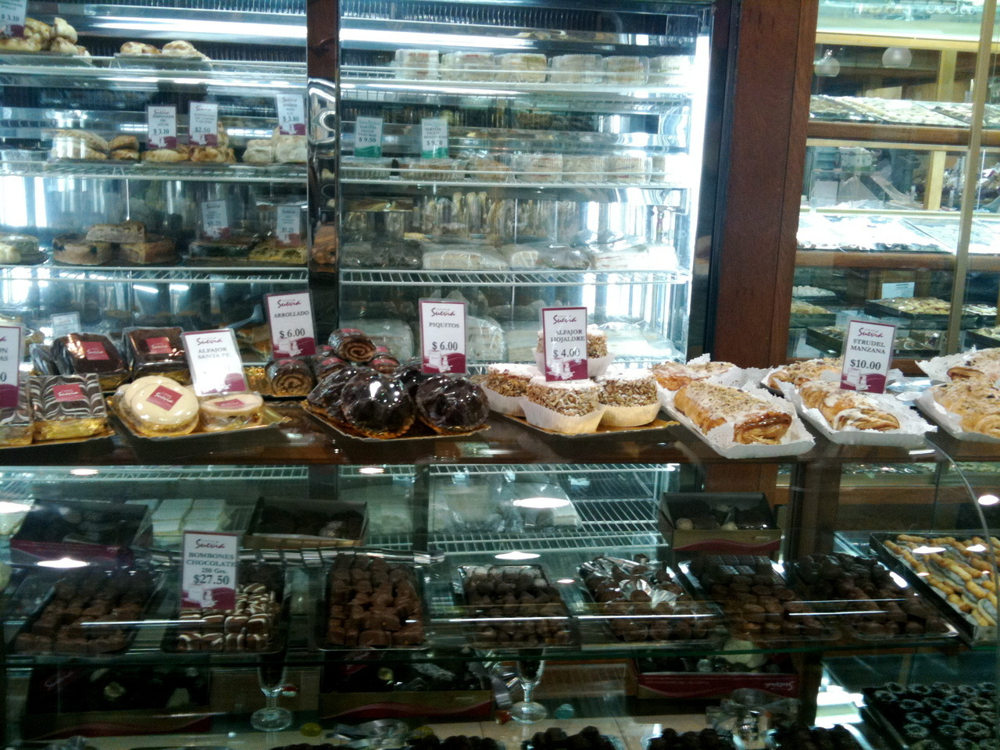
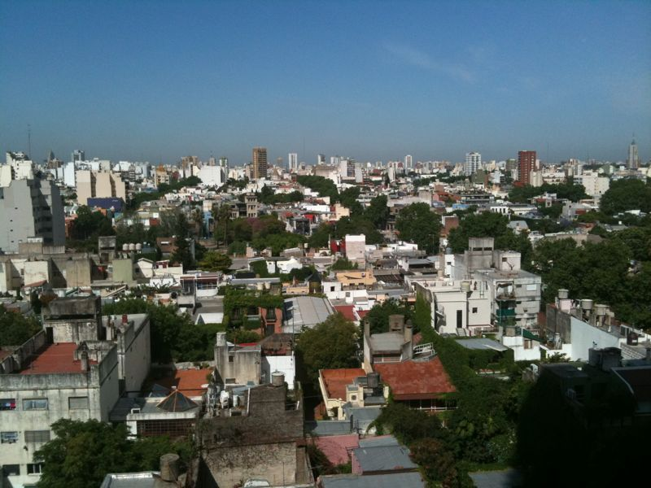
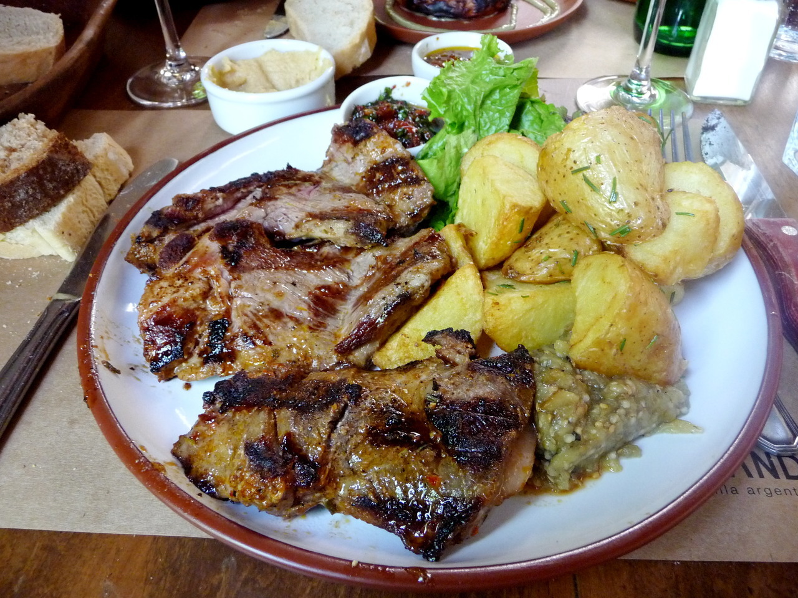
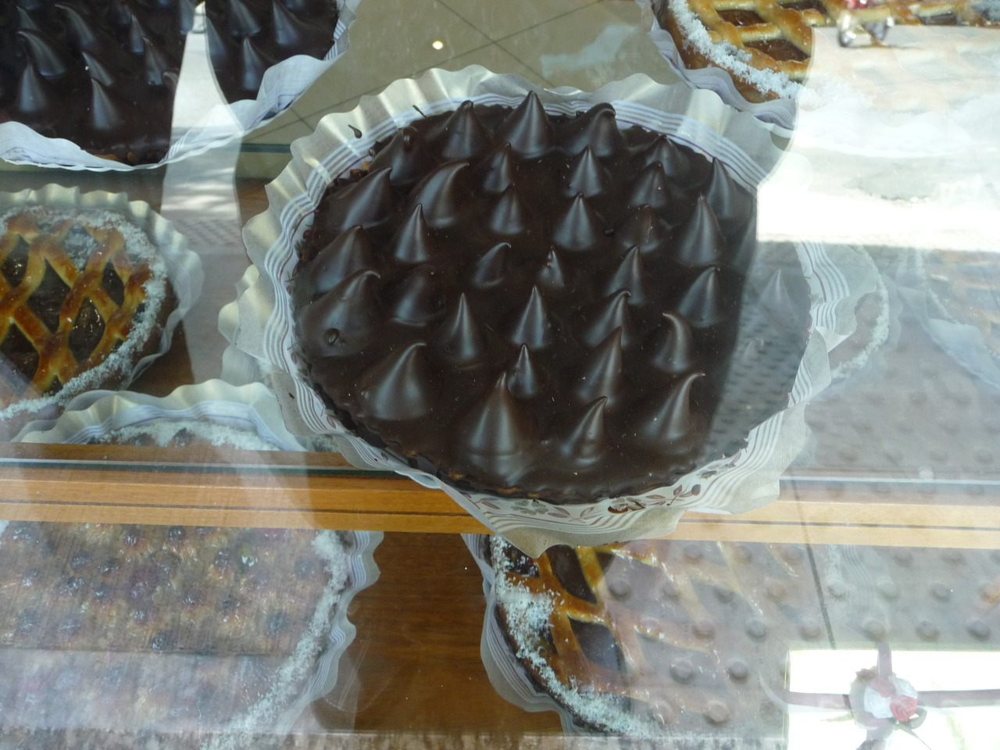
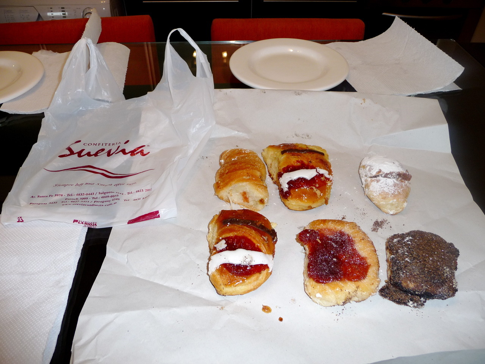

---
 

Dog whisperers of Buenos Aires. Dogs must love it here.

---
 

Another simple breakfast from
_[Confitería Suevia](http://sueviaconfiteria.com.ar/ "Confitería Suevia")_.

Wish they had one in Portland.

---
 

Lunch for me was an empanada&nbsp;picante&nbsp;de carne cortada a cuchillo and
this guisado de cordera con papas andinas y quinoa from La Paila in
Palermo Soho. Very tasty. Met two college students from Washington here
on an exchange program. One of them was staying with the owner of the
restaurant.

---
 

June also had an empanada picante, and this locro or stew. &nbsp;It’s a
traditional Tucuman dish which had white corn, butter beans, beef, chorizo
sausage, onions, and a bit of squash with a salsa picante. La Paila
specializes in dishes from Tucuman province.

---
 

Another sunny morning in Palermo Soho.

---
 

Buenos Aires restaurants seriously need portion control. I ordered Patagonian
lamb for lunch as I was getting tired of beef. I got enough to last a week. $12
USD.

---
 

We found another bakery about six blocks from our apartment we like even more
called Las Familias.

---
 

We bought pastries from [Confiteria Suevia](http://sueviaconfiteria.com.ar/) for
breakfast. Total cost $1.75. Viva Argentina.

---
 

The sunset was spectacular. Afterwards we walked to dinner at our favorite
parilla – _[Don Julio](http://tinyurl.com/yd85fdt)_

---
 

Looking southwest from the terrace at our apartment, Palermo Soho looks quite
tranquil at sunset.

---
 

Looking northeast reminds you it’s actually a bustling metropolis.

