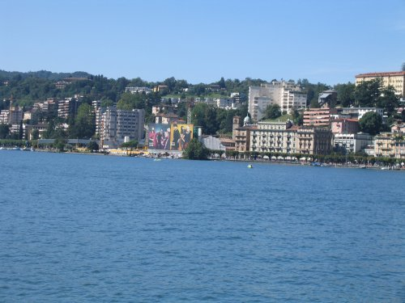

___
 

What I felt like after traveling from Portland to Lugano

___
 

We stayed at the Hotel Lugano Dante on the Piazza Cioccaro

___
 

The funicular dropped us off right at the entrance to our hotel

___
 

Small harbor seen from the train between Zurich and Lugano

___
 

Our hotel room in Lugano

___
 

Lugano hotels viewed across the lake from the city park

___
 

If you look carefully, you can see the funicular which goes up Mount Bre.

___
 

A funicular runs from the train station to the old city

___

We found a B&B that looks interesting in Alba called 
_[Villa la Favorita](https://villalafavorita-alba.it/en/)_
run by Roberta Giresole. Our friends from [Nostrana](http://nostrana.com/)
suggested we eat at _[Osteria La Libera](http://lalibera.com)_ in Alba,
_[La Contea](http://www.la-contea.it/)_
in Nieve, _Antica Torre_ in Barbaresco, and Cesare Giaccone’s _L'Angolo del
Paradiso_ in Albaretto della Torre.

About the latter, Patrica Wells explains: “Much of Da Cesare’s cuisine might be
described as primordial, it is so earthy and rudimentary, like spit-roasted goat
cooked in the corner of the restaurant over beech and oakwood coals, or his
thick fillet of beef seared on a scorching-hot limestone rock. Yet other dishes
\- an ethereal guinea-hen mousse paired with roasted potatoes drizzled with
grappa - seem to have come special delivery on the wings of an angel.”

Yumm! I can’t wait.

___

A few weeks ago, we discovered a wonderful Italian blue cheese called Rossini
Erborinato. It comes from the Bergamo region of Italy. So after we leave the
ESUG conference in [Lugano](http://www.lugano.ch), we’re heading to the
[Brembana Valley](http://www.vallebrembana.org/inglese/) to see where it’s made.

We’ll be staying at a small inn near the
[Parco dei Colli di Bergamo](http://www.parks.it/parco.colli.bergamo/Eindex.html) called
_[La Valletta Relais](https://www.lavallettabergamo.it/index-en.php)_.

