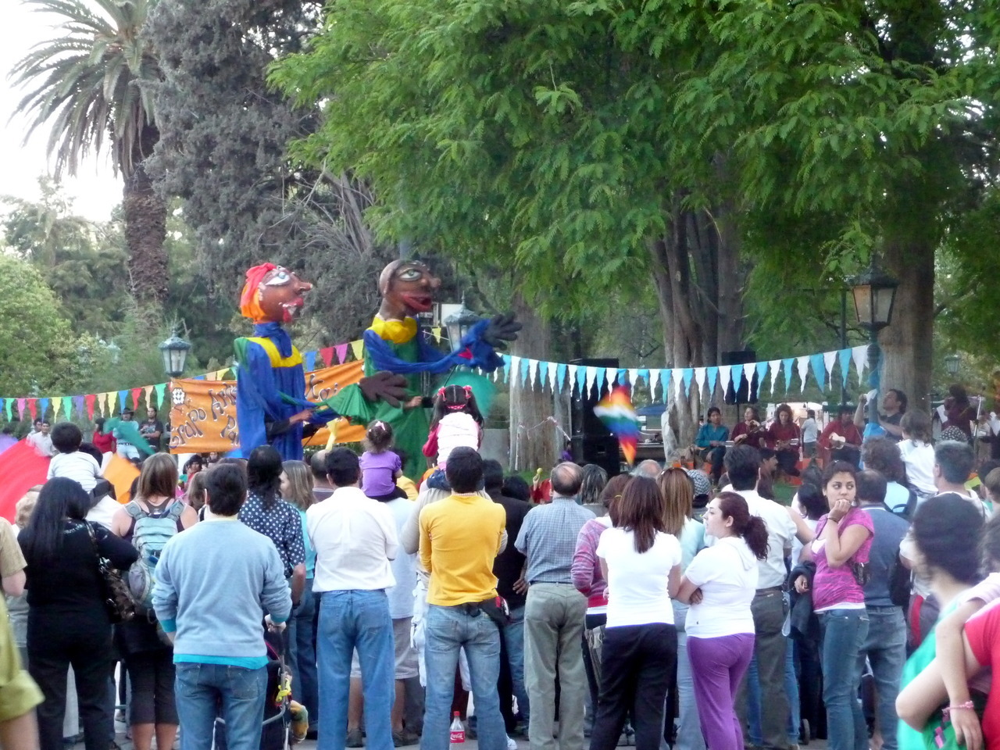
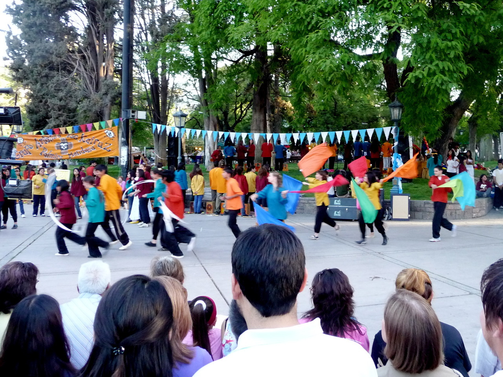
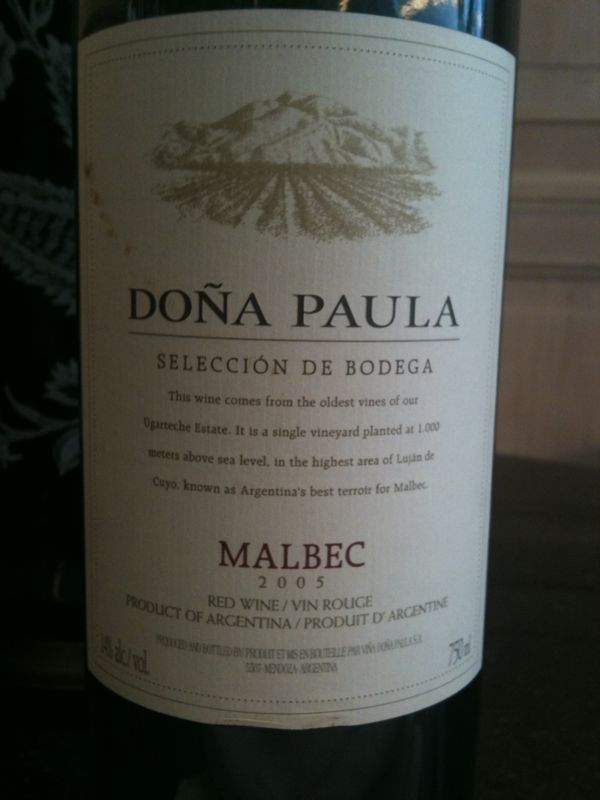
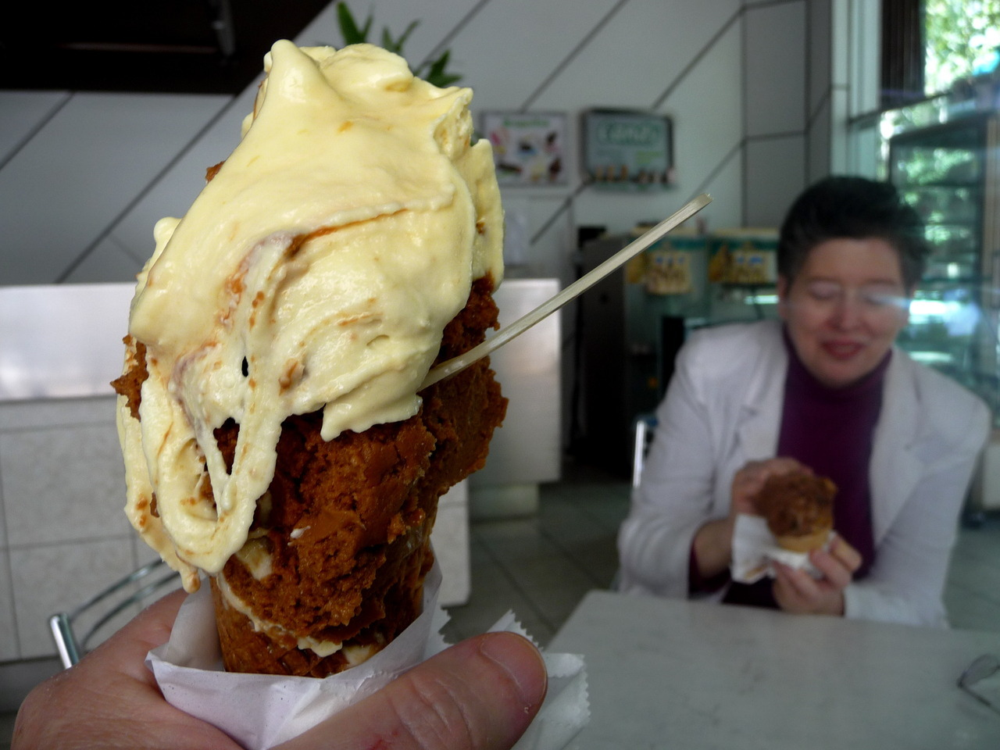
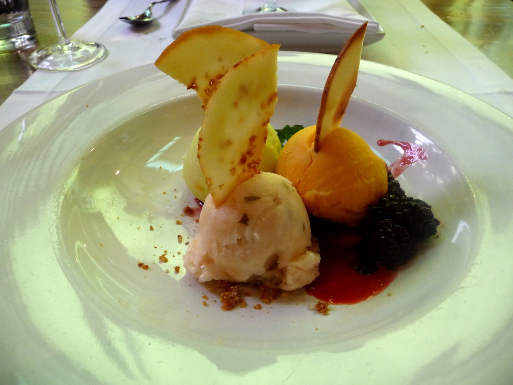
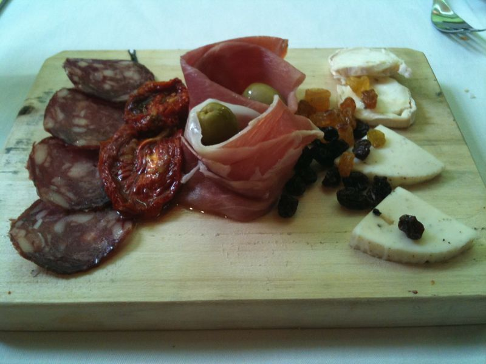

___
 

There was singing, dancing, folk theater, performers on stilts – all accompanied
by drums, guitars,   pan flutes, etc. We watched for more than an hour.

___
 

There was a festival in Plaza Independencia. Part of&nbsp;“De la montaña al
mar”. Performers were     from&nbsp;Escuela 4-064 Intendente Juan Kairuz de
Palmira, Mendoza.

___
 

Lunch at La Bourgogne in town was braised lamb with ratatouille and aubergines
and this excellent     Malbec.

___
 
 
··

I feel like I died and went to Big Rock Candy Mountain. Dulce de Leche ice cream
with bananas topped  by peach ice cream. A bit later … grapefruit, lime, and
tangerine sorbet.

___
 

Appetizer for lunch at Azafran

