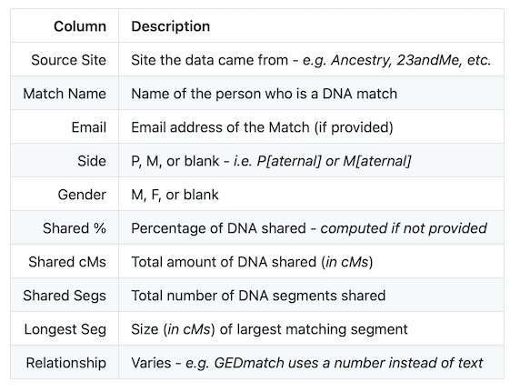

# gh-pages_test

Formatting on GitHub pages wasn't what I expected.

I've had too many problems installing Jekyll locally.

A temporary repo to play with formatting seemed like the simplest solution.

I've started with no theme selected.

## Tests from my repositories

[DNA_Match_Manager](DNA_Match_Manager_README.md)

[IMDb_xref](IMDb_xref_README.md)

[WhatsStreamingToday](WhatsStreamingToday_README.md)

[Wordled](wordled_README.md)

## Tests from others' repositories

[Levenshtein](Levenshtein_README.md)

##Problem areas

### Tables

Screenshot with no theme selected:

As displayed using current theme:

| Column | Description |
|--------:|:-------------|
| Source Site | Site the data came from - *e.g. Ancestry, 23andMe, etc.* |
| Match Name | Name of the person who is a DNA match |
| Email | Email address of the Match (if provided) |
| Side | P, M, or blank - *i.e. P[aternal] or M[aternal]* |
| Gender | M, F, or blank |
| Shared % | Percentage of DNA shared - *computed if not provided* |
| Shared cMs | Total amount of DNA shared (*in cMs*) |
| Shared Segs | Total number of DNA segments shared |
| Longest Seg | Size (*in cMs*) of largest matching segment |
| Relationship | Varies - *e.g. GEDmatch uses a number instead of text* |
