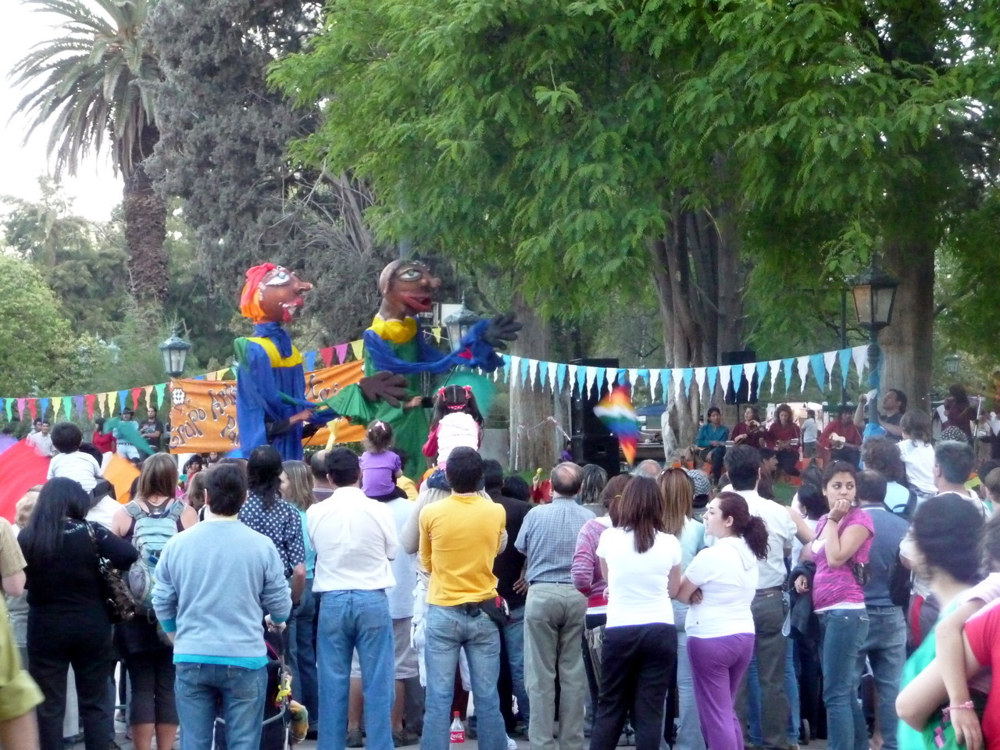
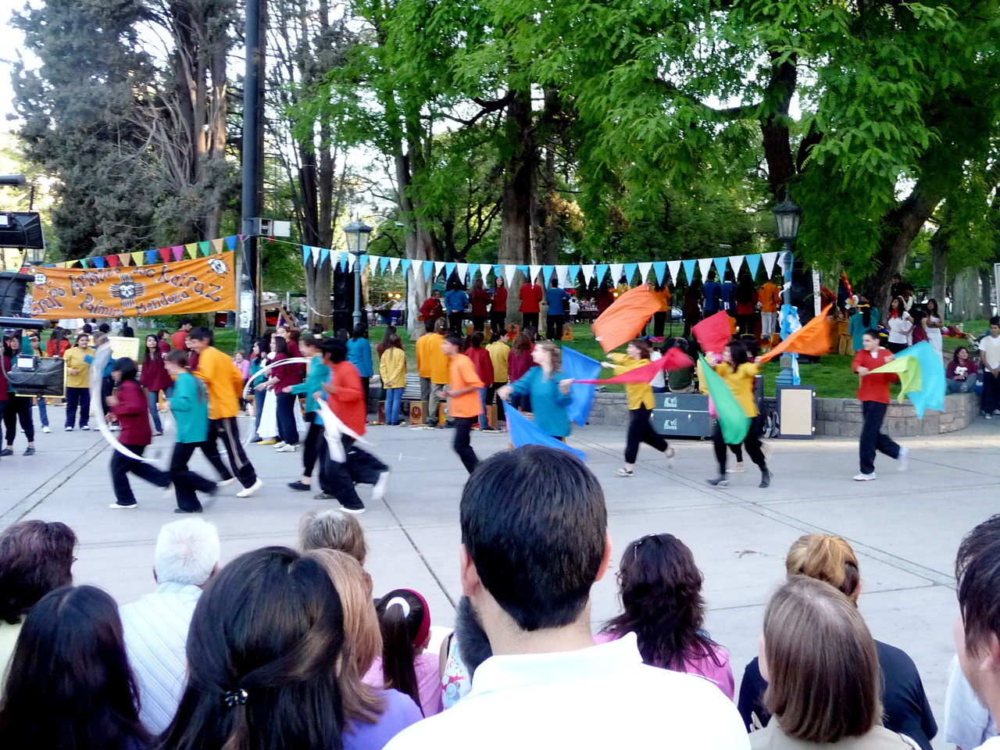

# My Old Tumblr Blog

## 2009 trip to Buenos Aires

 

Dog whisperers of Buenos Aires. Dogs must love it here.

***
 

Another simple breakfast from
_[Confitería Suevia](http://sueviaconfiteria.com.ar/ "Confitería Suevia")_.

Wish they had one in Portland.

***
 

Lunch for me was an empanada&nbsp;picante&nbsp;de carne cortada a cuchillo and
this guisado de cordera con papas andinas y quinoa from La Paila in
Palermo Soho. Very tasty. Met two college students from Washington here
on an exchange program. One of them was staying with the owner of the
restaurant.

***
 

June also had an empanada picante, and this locro or stew. &nbsp;It’s a
traditional Tucuman dish which had white corn, butter beans, beef, chorizo
sausage, onions, and a bit of squash with a salsa picante. La Paila
specializes in dishes from Tucuman province.

***
 

Another sunny morning in Palermo Soho.

***
 

Buenos Aires restaurants seriously need portion control. I ordered Patagonian
lamb for lunch as I was getting tired of beef. I got enough to last a week. $12
USD.

***
 

We found another bakery about six blocks from our apartment we like even more
called Las Familias.

***
 

We bought pastries from [Confiteria Suevia](http://sueviaconfiteria.com.ar/) for
breakfast. Total cost $1.75. Viva Argentina.

***
 

The sunset was spectacular. Afterwards we walked to dinner at our favorite
parilla – _[Don Julio](http://tinyurl.com/yd85fdt)_

***
 

Looking southwest from the terrace at our apartment, Palermo Soho looks quite
tranquil at sunset.

***
 

Looking northeast reminds you it’s actually a bustling metropolis.

## 2009 trip to Mendoza

 

There was singing, dancing, folk theater, performers on stilts – all accompanied
by drums, guitars,   pan flutes, etc. We watched for more than an hour.

___
 

There was a festival in Plaza Independencia. Part of&nbsp;“De la montaña al
mar”. Performers were     from&nbsp;Escuela 4-064 Intendente Juan Kairuz de
Palmira, Mendoza.

___
 

Lunch at La Bourgogne in town was braised lamb with ratatouille and aubergines
and this excellent     Malbec.

___
 
 
··

I feel like I died and went to Big Rock Candy Mountain. Dulce de Leche ice cream
with bananas topped  by peach ice cream. A bit later … grapefruit, lime, and
tangerine sorbet.

___
 

Appetizer for lunch at Azafran

## 2009 trip to Italy

### Lugano

 

What I felt like after traveling from Portland to Lugano

___
 

We stayed at the Hotel Lugano Dante on the Piazza Cioccaro

___
 

The funicular dropped us off right at the entrance to our hotel

___
 

Small harbor seen from the train between Zurich and Lugano

___
 

Our hotel room in Lugano

___
 

Lugano hotels viewed across the lake from the city park

___
 

If you look carefully, you can see the funicular which goes up Mount Bre.

___
 

A funicular runs from the train station to the old city

### Alba

We found a B&B that looks interesting in Alba called 
_[Villa la Favorita](https://villalafavorita-alba.it/en/)_
run by Roberta Giresole. Our friends from [Nostrana](http://nostrana.com/)
suggested we eat at _[Osteria La Libera](http://lalibera.com)_ in Alba,
_[La Contea](http://www.la-contea.it/)_
in Nieve, _Antica Torre_ in Barbaresco, and Cesare Giaccone’s _L'Angolo del
Paradiso_ in Albaretto della Torre.

About the latter, Patrica Wells explains: “Much of Da Cesare’s cuisine might be
described as primordial, it is so earthy and rudimentary, like spit-roasted goat
cooked in the corner of the restaurant over beech and oakwood coals, or his
thick fillet of beef seared on a scorching-hot limestone rock. Yet other dishes
\- an ethereal guinea-hen mousse paired with roasted potatoes drizzled with
grappa - seem to have come special delivery on the wings of an angel.”

Yumm! I can’t wait.

### Bergamo

A few weeks ago, we discovered a wonderful Italian blue cheese called Rossini
Erborinato. It comes from the Bergamo region of Italy. So after we leave the
ESUG conference in [Lugano](http://www.lugano.ch), we’re heading to the
[Brembana Valley](http://www.vallebrembana.org/inglese/) to see where it’s made.

We’ll be staying at a small inn near the
[Parco dei Colli di Bergamo](http://www.parks.it/parco.colli.bergamo/Eindex.html) called
_[La Valletta Relais](https://www.lavallettabergamo.it/index-en.php)_.

